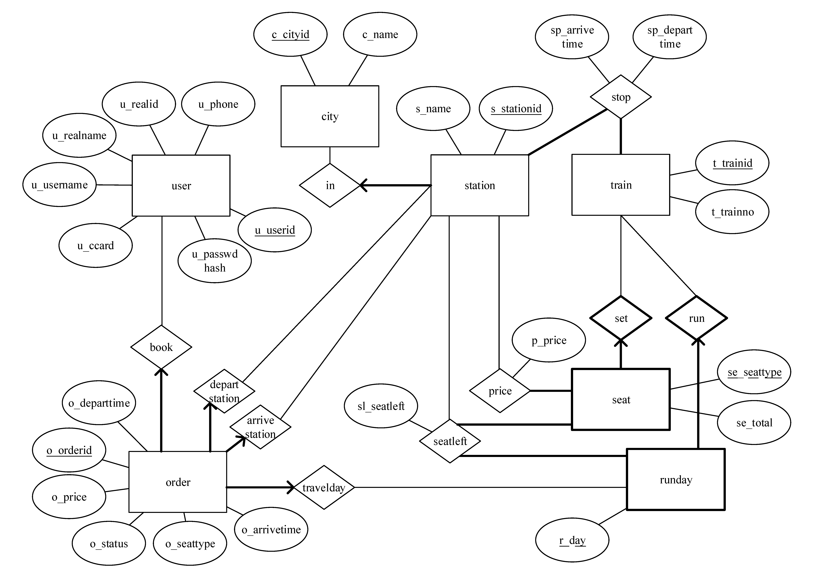
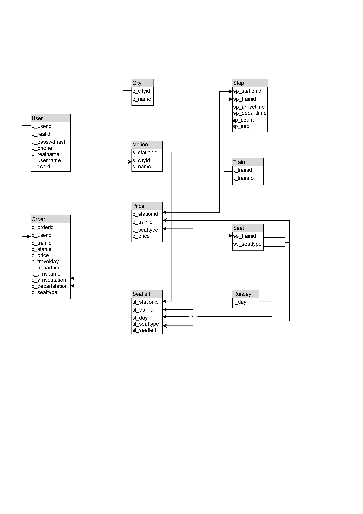

# 火车订票系统 设计报告

何南 2018K8009918003

郭光曜 2018K8009929007

陈彦帆 2018K8009918002

[TOC]


## 1. 数据库系统设计

### ER图



我们设计的实体-联系图中共有6个实体集。5个强实体分别为user：描述用户属性，station：描述车站属性，train：描述列车属性，order：描述订单属性, runday：记录所有列车的始发日期。

seat是一个弱实体，依赖于train而存在，和train一起描述某个列车上各种类型的座位总数。其中se_seattype是部分键，用于决定每个列车中的座位类型。

runday用于记录所有列车的始发日期，只有当某个日期在runday中时，所有列车才能开放购票。

stop是train和station之间多对多的联系，描述每个列车在每个车站的到达、出发时刻。

price是seat和station之间多对多的联系，描述每个列车每种座位类型在某个站的累积价格。注意到有的站不售票，有的station没有参与这个联系。

seatleft是seat,station和runday的三元联系，描述每个列车在每个发车日期在某个站的座位剩余情况。注意到有的站不售票，故有的station没有参与这个联系。


### 关系模式

#### schema



#### table layouts

1. city 城市

| 列名     | 描述     | 数据种类    | 附注          |
| -------- | -------- | ----------- | ------------- |
| c_cityid | 城市序号 | int         | candidate key |
| c_name   | 城市名   | varchar(20) | candidate key |

Primary Key：c_cityid


​	

2. station 车站

| 列名        | 描述               | 数据种类    | 附注                                             |
| ----------- | ------------------ | ----------- | ------------------------------------------------ |
| s_stationid | 车站序号           | int         | candidate key                                    |
| s_cityid    | 车站所在的城市序号 | int         | foreign key (s_cityid) references city(c_cityid) |
| s_name      | 车站名             | varchar(20) | candidate key                                    |

Primary Key：s_stationid

3. train 火车

| 列名      | 描述       | 数据种类 | 附注          |
| --------- | ---------- | -------- | ------------- |
| t_trainid | 火车序号   | int      | candidate key |
| t_trainno | 火车车次号 | char(6)  | candidate key |

Primary Key：t_trainid

4. seat 座位表

| 列名        | 描述                       | 数据种类 | 附注                                                 |
| ----------- | -------------------------- | -------- | ---------------------------------------------------- |
| se_trainid  | 火车序号                   | int      | foreign key (se_trainid) references train(t_trainid) |
| se_seattype | 座位类型                   | enum     | 可能包括硬座/软座，硬卧（上/中/下），软卧（上/下）   |
| se_total    | 该火车该座位类型的座位总数 | int      |                                                      |

Compound Primary Key：se_trainid，se_seattype

5. stop 火车时刻表

| 列名          | 描述         | 数据种类 | 附注                                                       |
| ------------- | ------------ | -------- | ---------------------------------------------------------- |
| sp_stationid  | 车站序号     | int      | foreign key (sp_stationid) references station(s_stationid) |
| sp_trainid    | 火车序号     | int      | foreign key (sp_trainid) references train(t_trainid)       |
| sp_count      | 火车过夜天数 | int      | 火车到站时，相对于始发时间经过的午夜次数                   |
| sp_seq        | 火车到站次序 | int      |                                                            |
| sp_arrivetime | 到达时间     | time     |                                                            |
| sp_departtime | 离开时间     | time     |                                                            |

Compound Primary Key：sp_stationid，sp_trainid  

6. price 座位价格表

| 列名        | 描述     | 数据种类 | 附注                                                         |
| ----------- | -------- | -------- | ------------------------------------------------------------ |
| p_stationid | 车站序号 | int      | foreign key (p_stationid) references station(s_stationid)    |
| p_trainid   | 火车序号 | int      | compound foreign key reference to (se_seattype, se_trainid) with p_seattype |
| p_seattype  | 座位类型 | enum     | compound foreign key reference to (se_seattype, se_trainid) with p_trainid |
| p_price     | 价格     | decimal  |                                                              |

Compound Primary Key：p_stationid，p_trainid，p_seattype

7. runday 发车日期

| 列名  | 描述     | 数据种类 | 附注 |
| ----- | -------- | -------- | ---- |
| r_day | 发车日期 | date     |      |

Compound Primary Key：r_day，r_trainid

8. seatleft 剩余座位表

| 列名         | 描述     | 数据种类 | 附注                                                         |
| ------------ | -------- | -------- | ------------------------------------------------------------ |
| sl_stationid | 车站序号 | int      | foreign key (sl_stationid) references station(s_stationid)   |
| sl_trainid   | 火车序号 | int      | compound foreign key reference to (r_day, r_trainid) with sl_day<br />compound foreign key reference to (se_seattype, se_trainid) with sl_seattype |
| sl_day       | 发车日期 | date     | compound foreign key reference to (r_day, r_trainid) with sl_day |
| sl_seattype  | 座位类型 | enum     | compound foreign key reference to (se_seattype, se_trainid) with sl_trainid |
| sl_seatleft  | 剩余座位 | int      | initialize as seat(se_total)                                 |

Compound Primary Key：sl_stationid，sl_trainid，sl_day，sl_seattype


9. user 用户

| 列名         | 描述         | 数据类型    | 附注           |
| ------------ | ------------ | ----------- | -------------- |
| u_userid     | 用户序号     | int         | candidate key  |
| u_realid     | 身份证号     | char(18)    | candidate key  |
| u_username   | 用户名       | varchar(20) |                |
| u_realname   | 用户真名     | varchar(20) |                |
| u_ccard      | 信用卡号     | char(16)    |                |
| u_passwdhash | 密码的哈希值 | char(32)    | 不存储明文密码 |
| u_phone      | 电话号码     | bigint      | candidate key  |

Primary Key：u_userid

10. order 订单

| 列名            | 描述       | 数据类型 | 附注                                                         |
| --------------- | ---------- | -------- | ------------------------------------------------------------ |
| o_orderid       | 订单序号   | int      | candidate key                                                |
| o_userid        | 用户序号   | int      | foreign key (o_userid) references user(u_userid) on delete cascade on update cascade |
| o_trainid       | 火车序号   | int      | compound foreign key reference to (r_day, r_trainid) with o_travelday |
| o_status        | 订单状态   | enum     | 包括已完成，未完成，已取消                                   |
| o_price         | 订单价格   | decimal  | 包括订票费                                                   |
| o_departtime    | 出发时间   | time     |                                                              |
| o_arrivetime    | 到达时间   | time     |                                                              |
| o_travelday     | 出发日期   | date     |                                                              |
| o_departstation | 始发站序号 | int      | foreign key (o_departstation) references station(s_stationid) |
| o_arrivestation | 到达站序号 | int      | foreign key (o_arrivestation) references station(s_stationid) |
| o_seattype      | 座位类型   | enum     |                                                              |
| o_istrans       | 是否换乘   | enum     |                                                              |

Primary Key：o_orderid


### 范式分析

首先，以上关系模式每一列都是原子的，故为1NF。

一个关系模式是BCNF的，等价于其所有非平凡完全函数依赖的被依赖方均为候选键。其中，完全函数依赖是指依赖方不依赖于被依赖方的任何一个真子集的函数依赖。接下来我们将说明，上节给出的所有关系模式都是BCNF的。

1. city 城市

假设没有重名的城市，所有的非平凡完全函数依赖有:

c_cityid->其它

c_cname->其它

c_cityid和c_cname都是候选键，故为BCNF。

2. station 车站

假设没有重名的车站，所有的非平凡完全函数依赖有:

s_stationid->其它

s_name->其它

被依赖方均为候选键，故为BCNF

3. train火车

考察所有的非平凡完全函数依赖:

t_trainid->其它

t_trainno->其它

被依赖方均为候选键，故为BCNF

4. seat座位表

考察所有的非平凡完全函数依赖:

se_trainid, se_seattype->se_total

被依赖方为主键，故为BCNF

5. stop火车时刻表

考察所有的非平凡完全函数依赖:

sp_stationid, sp_trainid->sp_arrivetime, sp_departtime,sp_count,sp_seq

被依赖方为主键，故为BCNF

注意，虽然可以通过比较所有的sp_count和sp_arrivetime, sp_departtime来确定某一次列车某一站的到站次序sp_seq，但并不构成函数依赖。

6. price座位价格表

考察所有的非平凡完全函数依赖:

p_stationid，p_trainid，p_seattype->p_price

被依赖方为主键，故为BCNF

7. runday发车日期

该表唯一的列为主键，故为BCNF

8. seatleft剩余座位

考察所有的非平凡完全函数依赖:

sl_stationid，sl_trainid，sl_day，sl_seattype->sl_seatleft

被依赖方为主键，故为BCNF

9. user 用户

u_userid, u_realid, u_phone均为唯一的，可决定其它所有项，它们都是候选键。除此之外，不存在其它的非平凡完全函数依赖，故为BCNF。

10. order 订单

主键是o_orderid，可决定其它所有属性。

若火车时刻表是不变的，则有以下的非键传递依赖：

o_trainid, o_departstation->o_departtime

o_trainid, o_arrivestation->o_arrivetime

作为修改，只需将o_departtime和o_arrivetime删除即可，需要的时候在stop联系中查询。但考虑到火车时刻表可能变化的情况，给定列车号，出发地和到达地就无法确定出发和到达时刻了。以上的依赖也将不存在。

同样，若火车价格是不变的，有以下的非键传递依赖：

o_trainid, o_departstation, o_arrivestation, o_seattype->o_price

作为修改，只需将o_price删除，需要的时候再通过price联系重新计算订单价格。考虑到火车价格在较长的时间里可能发生变化，又或是打折的情况，以上的依赖就不存在了。故order也是BCNF的。

综上，上节给出的所有关系模式都是BCNF的。


## 2.功能实现的SQL语句

本次实验完成了所有需求。

#### 0. 建表语句

```sql
create type seattype as enum('硬座','软座','硬卧上','硬卧中','硬卧下','软卧上','软卧下');
create type order_status as enum('有效','已取消');
create type transtype as enum('否','第一次','第二次');
create table city    (c_cityid      integer primary key,
                      c_name        varchar(20) unique
                    );   
create table station (s_stationid   integer primary key,
                      s_cityid      integer not null,
                      s_name        varchar(20) unique,
                      foreign key (s_cityid) references city(c_cityid)
                    );
create table train   (t_trainid     integer primary key,
                      t_trainno     char(6) unique
                    );                    
create table runday  (r_day           Date primary key
                      );
create table stop    (sp_trainid        integer not null,
                      sp_stationid      integer not null,   
                      sp_arrivetime     time,
                      sp_departtime     time,
                      sp_count          integer not null,
                      sp_seq            integer not null,
                      primary key (sp_trainid,sp_stationid),
                      foreign key (sp_stationid) references station(s_stationid),
                      foreign key (sp_trainid) references train(t_trainid)
                    );
create table price   (p_trainid    integer not null,
                      p_stationid  integer not null,
                      p_seattype   seattype,
                      p_price      decimal(15,2) not null,
                      primary key (p_trainid, p_stationid, p_seattype),
                      foreign key (p_stationid) references station(s_stationid),
                      foreign key (p_trainid) references train(t_trainid)
                      );

create table seatleft (sl_day            Date,
                       sl_trainid        integer not null,
                       sl_stationid      integer not null,    
                       sl_seattype       seattype,             
                       sl_seatleft       integer not null,
                       primary key (sl_day,sl_trainid,sl_stationid,sl_seattype),
                       foreign key (sl_stationid) references station(s_stationid),
                       foreign key (sl_trainid) references train(t_trainid),
                       foreign key (sl_day) references runday(r_day)
                     );
create table usr     (u_userid       integer primary key,
                      u_username     varchar(20) unique,
                      u_phone        char(11) unique,
                      u_realid       char(18) unique,
                      u_realname     varchar(20) not null,
                      u_passwdhash   char(32) not null,
                      u_ccard        char(16) not null
                      );
create table orders   (o_orderid       integer primary key,
                      o_userid        integer not null,
                      o_trainid       integer not null,
                      o_status        order_status,
                      o_price         decimal(15,2) not null,
                      o_travelday     Date,
                      o_departtime    time,
                      o_arrivetime    time,
                      o_arrivestation integer not null,
                      o_departstation integer not null,
                      o_seattype      seattype,
                      o_istrans       transtype,
                      foreign key (o_userid) references usr(u_userid) on delete cascade on update cascade,
                      foreign key (o_trainid) references train(t_trainid),
                      foreign key (o_arrivestation) references station(s_stationid),
                      foreign key (o_departstation) references station(s_stationid)
                    );

create table seat    (se_trainid    integer not null,
                      se_seattype   seattype,
                     primary key (se_trainid , se_seattype),
                      foreign key (se_trainid) references train(t_trainid)
                    );
```


#### 1. 记录列车信息

​	如我们的schema中所示，我们将列车信息分别存在：station（车站）、train（列车）、stop(时刻表）、seat（座位）、price（票价）、seatleft（余票）中。station记录了车站id和车站名称；train记录列车id和列车名；时刻表中记录了某列车在某车站的到达时间、离开时间、当前站是经过的第几站以及当前列车是否已经过夜的信息；价格表中存储某列车自出发站起到某一站的某类座位车票价格；余票中则存储某天发车的某车次在某站的余票信息。

​	综上，数据库中记录了所有所需的列车信息。


#### 2. 记录列车座位情况

​	列车的座位类型和价格存储在price表，余票信息存储在seatleft表中。余票表中记录某天发车的某列车在当前站点到达下一站的票数。由管理员进行手动选择开票日期，然后余票信息更新到数据库中。

​	购票后将生成订单、更新余票，对应的查询语句在需求7中展示。


#### 3. 记录乘客信息

​	用户信息存储在user表中，包含：乘客姓名、身份证号、手机号、信用卡、用户名、用户密码、用户id。用户注册之后使用用户名和密码登录。

​	用户注册时更新数据语句如下：

```sql
-- :1 用户名$username 
-- :2 手机号$phone 
-- :3 身份证号$realid 
-- :4 真实姓名$realname 
-- :5 密码哈希$passwdhash 
-- :6 信用卡号$ccard
insert into 
	usr 
select 
	(case when maxid is null then 1 else maxid+1 end),
	':1',':2',':3',':4',':5',':6' 
from 
	(
        select 
        	max(u_userid) as maxid 
        from 
        	usr
    ) as xxx;
```


#### 4. 查询具体车次

​	通过输入车次和日期查询列车的所有信息，包括始发站、经停站、终点站、票价和余票信息。查询语句如下：

```sql
--:1 列车号$trainno
--:2 出发日期$day
with  t1(t1_seatleft,t1_stationid,t1_trainid,t1_seattype) as
(
    select 
      min(case when sp2.sp_seq=1 then null else sl_seatleft end),
      sp2.sp_stationid,t_trainid,sl_seattype
    from
      stop as sp1, stop as sp2, seatleft, train
    where 
      sp1.sp_trainid = sp2.sp_trainid and
      sp2.sp_trainid = t_trainid and
      t_trainno = ':1' and
      sp1.sp_stationid = sl_stationid and
      sl_day = ':2' and
      sl_trainid = t_trainid and
      (sp1.sp_seq<sp2.sp_seq or sp2.sp_seq=1)
    group BY
      sp2.sp_stationid,t_trainid,sl_seattype
    )
SELECT 
  sp_seq, s_name, sp_arrivetime,sp_departtime, sp_count,
  max(t1_seatleft) filter(where t1_seattype='硬座') as yz,
  max(t1_seatleft) filter(where t1_seattype='软座') as rz,
  max(t1_seatleft) filter(where t1_seattype='硬卧上') as yws,
  max(t1_seatleft) filter(where t1_seattype='硬卧中') as ywz,
  max(t1_seatleft) filter(where t1_seattype='硬卧下') as ywx,
  max(t1_seatleft) filter(where t1_seattype='软卧上') as rws,
  max(t1_seatleft) filter(where t1_seattype='软卧下') as rwx,
  max(p_price) filter(where t1_seattype='硬座') as yz,
  max(p_price) filter(where t1_seattype='软座') as rz,
  max(p_price) filter(where t1_seattype='硬卧上') as yws,
  max(p_price) filter(where t1_seattype='硬卧中') as ywz,
  max(p_price) filter(where t1_seattype='硬卧下') as ywx,
  max(p_price) filter(where t1_seattype='软卧上') as rws,
  max(p_price) filter(where t1_seattype='软卧下') as rwx
FROM
  station,price,stop,t1
WHERE
  t1_stationid = p_stationid and 
  s_stationid = t1_stationid and
  p_trainid = t1_trainid and
  sp_trainid = t1_trainid and
  sp_stationid = t1_stationid and 
  t1_seattype = p_seattype 
GROUP BY 
  sp_seq, s_name, t1_stationid,sp_arrivetime,sp_departtime, sp_count
ORDER BY
  sp_seq;
```


#### 5. 查询两地之间的车次

###### 		5.1 直达车辆查询

​	输入出发地、目的地、出发日期时间，显示两地之间10列直达列车及其余票信息。其中，余票信息为从始发站到当前站的余票。查询语句如下：

```sql
-- :1 出发日期$sday
-- :2 (出发/目的)城市$scity/$ecity
-- :3 出发时间$stime
SELECT
  t_trainno,
  S1.s_name,--始发站
  S2.s_name,--终点站
  to_timestamp(':1','yyyy-MM-dd')+SL.departtime,--从出发站离开日期时间
  SL.slday + SL.count2 + SL.arrivetime,
  (case when SL.departtime>=SL.arrivetime0
        then to_date('2020-9-1','yyyy-MM-dd')+SL.count2-SL.count1+SL.arrivetime-SL.departtime-to_timestamp('2020-9-1 00:00:00','yyyy-MM-dd hh24:mi:ss')
        else to_date('2020-9-1','yyyy-MM-dd')+SL.count2-SL.count1-1+SL.arrivetime-SL.departtime-to_timestamp('2020-9-1 00:00:00','yyyy-MM-dd hh24:mi:ss')
        end) 
    as total_time, 
  max(SL.seatleft) filter(where SL.seattype='硬座') as yz_left,
  max(SL.seatleft) filter(where SL.seattype='软座') as rz_left,
  max(SL.seatleft) filter(where SL.seattype='硬卧上') as yws_left,
  max(SL.seatleft) filter(where SL.seattype='硬卧中') as ywz_left,
  max(SL.seatleft) filter(where SL.seattype='硬卧下') as ywx_left,
  max(SL.seatleft) filter(where SL.seattype='软卧上') as rws_left,
  max(SL.seatleft) filter(where SL.seattype='软卧下') as rwx_left,
  max(P2.p_price-P1.p_price) filter(where P1.p_trainid=P2.p_trainid and P1.p_seattype=P2.p_seattype and P1.p_seattype='硬座') as yz_price,
  max(P2.p_price-P1.p_price) filter(where P1.p_trainid=P2.p_trainid and P1.p_seattype=P2.p_seattype and P1.p_seattype='软座') as rz_price,
  max(P2.p_price-P1.p_price) filter(where P1.p_trainid=P2.p_trainid and P1.p_seattype=P2.p_seattype and P1.p_seattype='硬卧上') as yws_price,
  max(P2.p_price-P1.p_price) filter(where P1.p_trainid=P2.p_trainid and P1.p_seattype=P2.p_seattype and P1.p_seattype='硬卧中') as ywz_price,
  max(P2.p_price-P1.p_price) filter(where P1.p_trainid=P2.p_trainid and P1.p_seattype=P2.p_seattype and P1.p_seattype='硬卧下') as ywx_price,
  max(P2.p_price-P1.p_price) filter(where P1.p_trainid=P2.p_trainid and P1.p_seattype=P2.p_seattype and P1.p_seattype='软卧上') as rws_price,
  max(P2.p_price-P1.p_price) filter(where P1.p_trainid=P2.p_trainid and P1.p_seattype=P2.p_seattype and P1.p_seattype='软卧下') as rwx_price,
  min(P2.p_price-P1.p_price) filter(where P1.p_trainid=P2.p_trainid and P1.p_seattype=P2.p_seattype and SL.seatleft>0) as price
FROM    
  station as S1,
  station as S2,
  train,
  price as P1,
  price as P2,
  (
      SELECT
          ST1.sp_stationid as departstation,
          ST3.sp_stationid as arrivestation,
          sl_trainid as trainid,
          sl_seattype as seattype,
          min(sl_seatleft) as seatleft,
          ST1.sp_departtime as departtime,
          ST1.sp_arrivetime as arrivetime0,
          ST3.sp_arrivetime as arrivetime,
          ST1.sp_count as count1,
          ST3.sp_count as count2,
          sl_day as slday
      FROM
          seatleft,
          stop as ST1,
          stop as ST2,
          stop as ST3,
          city as CI1,
          city as CI2,
          station as SI1,
          station as SI2
      WHERE
          CI1.c_name=':2' and
          CI2.c_name=':2' and
          CI1.c_cityid=SI1.s_cityid and
          CI2.c_cityid=SI2.s_cityid and
          ST1.sp_stationid=SI1.s_stationid and
          ST3.sp_stationid=SI2.s_stationid and
          ST1.sp_trainid=ST3.sp_trainid and
          ST2.sp_trainid = ST3.sp_trainid and
          ST1.sp_departtime >= ':3' and
          sl_trainid=ST1.sp_trainid and
          sl_stationid=ST2.sp_stationid and
          (
            (
              ST1.sp_departtime>=ST1.sp_arrivetime and
              ':1'=ST1.sp_count+sl_day
            )
              or
            (
              ST1.sp_departtime<ST1.sp_arrivetime and
              ':1'=ST1.sp_count+sl_day+1
            )
          )
          and 
          (
              ST2.sp_count>ST1.sp_count
              or
              (
                  ST2.sp_count=ST1.sp_count and
                  ST1.sp_arrivetime<=ST2.sp_arrivetime
              )
          )and
          (
              ST3.sp_count>ST2.sp_count
              or
              (
                  ST3.sp_count=ST2.sp_count and
                  ST2.sp_arrivetime<ST3.sp_arrivetime
              )
          )
      GROUP BY
          departstation,
          arrivestation,
          trainid,
          seattype,
          departtime,
          arrivetime0,
          arrivetime,
          count1,
          count2,
          slday
  )as SL
WHERE 
  S1.s_stationid=SL.departstation and
  S2.s_stationid=SL.arrivestation and
  SL.seattype=P2.p_seattype and
  P1.p_seattype=P2.p_seattype and
  P1.p_stationid=SL.departstation and
  P2.p_stationid=SL.arrivestation and
  P1.p_trainid=SL.trainid and
  P2.p_trainid=SL.trainid and
  t_trainid=SL.trainid 
GROUP BY
  S1.s_name,--始发站
  S2.s_name,--终点站
  t_trainno,
  SL.departtime,--从始发站离开时间
  SL.arrivetime0,
  SL.arrivetime,--到达终点站时间
  SL.count1,
  SL.count2,
  SL.slday
ORDER BY
   price;
```


###### 		5.2 一次换乘查询

​	查询换乘一次的列车组合和余票信息，要求换乘地是同一城市。若是同站换乘，则换乘时间需要（1h <= T  <=4h），若是异站换乘，换乘时间（2h <= T <= 4h）。

​	查询时为了优化查询时间，先进行子查询，包含满足发车时间和换乘时间所有的换乘可能。在这个基础上再进行子查询进一步查询两段换乘的总花费，选择花费最少的前200个方案。最后在这些方案中查找是否存在余票。得到最终的10组列车组和。查询语句如下：

```sql
-- :1 城市$city
-- :2 出发时间$time
-- :3 出发日期$day
-- 第一步选出所有的换乘可能
with transfer_table (
    day1, day2,
    s1c, s2c, s3c, s4c,
    s1s, s2s, s3s, s4s,
    s1_at, s1_dt, s2_at, 
    s3_at, s3_dt, s4_at,
	s1_id, s2_id, s3_id, s4_id, t1_id, t2_id
	) as
    (
     SELECT
        R1.r_day,
        R2.r_day,
        SP1.sp_count,
        SP2.sp_count,
        SP3.sp_count,
        SP4.sp_count,
        SP1.sp_seq,
        SP2.sp_seq,
        SP3.sp_seq,
        SP4.sp_seq,
        SP1.sp_arrivetime,
        SP1.sp_departtime,
        SP2.sp_arrivetime,
        SP3.sp_arrivetime,
        SP3.sp_departtime,
        SP4.sp_arrivetime,
        S1.s_stationid,
        S2.s_stationid,
        S3.s_stationid,
        S4.s_stationid,
        T1.t_trainid,
        T2.t_trainid
    FROM
        city as C1,
        city as C2,
        city as C3,
        station as S1,
        station as S2,
        station as S3,
        station as S4,
        train as T1,
        train as T2,
        stop as SP1,
        stop as SP2,
        stop as SP3,
        stop as SP4,
        runday as R1,
        runday as R2
    WHERE
        -- A start
        C1.c_name=':1' and
        S1.s_cityid=C1.c_cityid and
        -- B end
        C3.c_name=':1' and
        S4.s_cityid=C3.c_cityid and
        -- C transfer
        S2.s_cityid = C2.c_cityid and
        S3.s_cityid = C2.c_cityid and
        SP1.sp_stationid=S1.s_stationid and
        SP2.sp_stationid=S2.s_stationid and
        SP3.sp_stationid=S3.s_stationid and
        SP4.sp_stationid=S4.s_stationid and
        SP1.sp_departtime>':2' and
        SP1.sp_trainid=T1.t_trainid and
        SP2.sp_trainid=T1.t_trainid and
        SP3.sp_trainid = T2.t_trainid and
        SP4.sp_trainid = T2.t_trainid and
        T1.t_trainid != T2.t_trainid and
        (
            SP2.sp_count>SP1.sp_count
            or
            (
                SP2.sp_count=SP1.sp_count and
                SP1.sp_arrivetime<SP2.sp_arrivetime
            )
        )and
        (
            SP4.sp_count>SP3.sp_count
            or
            (
                SP4.sp_count=SP3.sp_count and
                SP3.sp_arrivetime<SP4.sp_arrivetime
            )
        )and
        -- date
        (
            (
                R1.r_day + SP1.sp_count = ':3' and
                SP1.sp_arrivetime <= SP1.sp_departtime 
            )or(
                SP1.sp_arrivetime > SP1.sp_departtime and
                R1.r_day + SP1.sp_count + 1 = ':3'
            )
        )
        and
        (
            (

                SP2.sp_stationid=SP3.sp_stationid and
                (
                    R2.r_day+SP3.sp_count+SP3.sp_departtime-
                    (R1.r_day+SP2.sp_count+SP2.sp_arrivetime)<=interval '4 hour' and
                    R2.r_day+SP3.sp_count+SP3.sp_departtime-
                    (R1.r_day+SP2.sp_count+SP2.sp_arrivetime)>=interval '1 hour'
                )
            )
            or
            (
                SP2.sp_stationid!=SP3.sp_stationid and
                (
                    R2.r_day+SP3.sp_count+SP3.sp_departtime-
                    (R1.r_day+SP2.sp_count+SP2.sp_arrivetime)<=interval '4 hour' and
                    R2.r_day+SP3.sp_count+SP3.sp_departtime-
                    (R1.r_day+SP2.sp_count+SP2.sp_arrivetime)>=interval '2 hour'
                )
            )
        )
    ORDER BY
        T1.t_trainid, 
        T2.t_trainid
    ),
-- 第二步计算换乘的总价格，选取前200个
 tmp(
    day1, day2, c1,c2,c3,c4,
    seq1,seq2,seq3,seq4,
    at1, dt1, at2,
    at3, dt3, at4,
    t1,t2,s1,s2,s3,s4,
    p1,p2,seat1,seat2,
    total_price
)as
(
SELECT
    transfer_table.day1,
    transfer_table.day2,
    transfer_table.s1c,
    transfer_table.s2c,
    transfer_table.s3c,
    transfer_table.s4c,
    transfer_table.s1s,
    transfer_table.s2s,
    transfer_table.s3s,
    transfer_table.s4s,
    transfer_table.s1_at,
    transfer_table.s1_dt,
    transfer_table.s2_at,
    transfer_table.s3_at,
    transfer_table.s3_dt,
    transfer_table.s4_at,
    transfer_table.t1_id,
    transfer_table.t2_id,
    transfer_table.s1_id,
    transfer_table.s2_id,
    transfer_table.s3_id,
    transfer_table.s4_id,
    P2.p_price-P1.p_price as price1,
    P4.p_price-P3.p_price as price2,
    P1.p_seattype,
    P3.p_seattype,
    P2.p_price-P1.p_price+P4.p_price-P3.p_price as price
FROM
    price as P1,
    price as P2,
    price as P3,
    price as P4,
    transfer_table
WHERE
    P1.p_stationid=transfer_table.s1_id and
    P2.p_stationid=transfer_table.s2_id and
    P1.p_trainid=transfer_table.t1_id and
    P2.p_trainid=transfer_table.t1_id and
    p1.p_seattype = P2.p_seattype and 
    P3.p_stationid=transfer_table.s3_id and
    P4.p_stationid=transfer_table.s4_id and
    P3.p_trainid=transfer_table.t2_id and
    P4.p_trainid=transfer_table.t2_id and
    P3.p_seattype = P4.p_seattype
ORDER BY
    price
LIMIT 200
),
-- 第三步查询该200次换乘是否有余票，计算总时间
final(
    total_price,d1,d2,
    s1,s2,t1,
    at1,dt1,at2,seat1,p1,sl1,
    s3,s4,t2,
    dt3,at4,seat2,p2,sl2,total_time
)as
(
SELECT
    tmp.total_price as price,
    tmp.day1 as d1,
    tmp.day2 as d2,
    S1.s_name as station1,
    S2.s_name as station2,
    T1.t_trainno as train1,
    tmp.at1 as arrivetime1,
    to_date(':3', 'yyyy-MM-dd') + tmp.dt1 as departtime1,
    tmp.day1 + tmp.c2 + tmp.at2 as arrivetime2,
    tmp.seat1 as seattype1,
    tmp.p1 as price1,
    min(SL1.sl_seatleft) as seatleft1,
    S3.s_name as station3,
    S4.s_name as station4,
    T2.t_trainno as train2,

    (case when tmp.at3<=tmp.dt3 then tmp.day2 + tmp.c3 + tmp.dt3
          else tmp.day2 + 1 + tmp.c3 + tmp.dt3 end)  as departtime3,
    tmp.day2 + tmp.c4 + tmp.at4 as arrivetime4,
    tmp.seat2 as seattype2,
    tmp.p2 as price2,
    min(SL2.sl_seatleft) as seatleft2,
    (case when tmp.at1<=tmp.dt1 then (tmp.day2+tmp.c4+tmp.at4)-(tmp.day1+tmp.c1+tmp.dt1)
          else (tmp.day2+tmp.c4+tmp.at4)-(tmp.day1+tmp.c1+1+tmp.dt1) end) as total_time
FROM
    station as S1,
    station as S2,
    station as S3,
    station as S4,
    train as T1,
    train as T2,
    stop as SP1,
    stop as SP2,
    seatleft as SL1,
    seatleft as SL2,
    tmp
WHERE
    S1.s_stationid=tmp.s1 and
    S2.s_stationid=tmp.s2 and
    S3.s_stationid=tmp.s3 and
    S4.s_stationid=tmp.s4 and
    T1.t_trainid=tmp.t1 and
    T2.t_trainid=tmp.t2 and
    SL1.sl_trainid=tmp.t1 and
    SL2.sl_trainid=tmp.t2 and
    SL1.sl_stationid=SP1.sp_stationid and
    SP1.sp_trainid=tmp.t1 and 
    SP2.sp_trainid=tmp.t2 and 
    SL1.sl_day=tmp.day1 and
    SL2.sl_day=tmp.day2 and
    SP1.sp_seq>=tmp.seq1 and
    SP1.sp_seq<tmp.seq2 and
    SL2.sl_stationid=SP2.sp_stationid and
    SP2.sp_seq>=tmp.seq3 and
    SP2.sp_seq<tmp.seq4
GROUP BY
    day1, day2,
    price,
    station1,
    station2,
    train1,
    arrivetime1,
    departtime1,
    arrivetime2,
    seattype1,
    price1,
    station3,
    station4,
    train2,
    departtime3,
    arrivetime4,
    seattype2,
    price2,
    total_time
ORDER BY
    price
)
,
SNLT(
    d1,d2,
    s1,s2,t1,
    dt1,at2,
    s3,s4,t2,
    dt3,at4,total_time,
    total_price
)as
(
SELECT
    d1,d2,
    s1,s2,t1,
    dt1,at2,
    s3,s4,t2,
    dt3,at4,total_time,
    min(final.total_price) filter(where final.sl1>0 and final.sl2>0) as price
    
FROM 
    -- NLT
    final
GROUP BY
    d1,d2,
    s1,s2,t1,
    dt1,at2,
    s3,s4,t2,
    dt3,at4,total_time
ORDER BY
    price
LIMIT 10
),
-- 第四步对上面的200个组合进一步查询两次换乘车辆的详细信息
LT(
  s1,s2,t1,seat1,dt1,at2,sl1,s3,s4,t2,seat2,dt3,at4,sl2,p1,p2,price,total_time
)as
(
SELECT
    
    SNLT.s1,
    SNLT.s2,
    SNLT.t1,
    SL1.sl_seattype as seattype1,
    SNLT.dt1 as dptime1,
    SNLT.at2,
    min(SL1.sl_seatleft) as seatleft1,
    SNLT.s3,
    SNLT.s4,
    SNLT.t2,
    SL2.sl_seattype as seattype2,
    SNLT.dt3,
    SNLT.at4,
    min(SL2.sl_seatleft) as seatleft2,
    P2.p_price - P1.p_price as price1,
    P4.p_price - P3.p_price as price2,
    SNLT.total_price as price,
    SNLT.total_time as total_time
FROM
    SNLT,
    station as S1,
    station as S2,
    station as S3,
    station as S4,
    train as T1,
    train as T2,
    stop as SP1,
    stop as SP2,
    stop as SP3,
    stop as SP4,
    stop as SP5,
    stop as SP6,
    seatleft as SL1,
    seatleft as SL2,
    price as P1,
    price as P2,
    price as P3,
    price as P4
WHERE
    S1.s_name = SNLT.s1 and
    S2.s_name = SNLT.s2 and
    S3.s_name = SNLT.s3 and
    S4.s_name = SNLT.s4 and
    T1.t_trainno = SNLT.t1 and
    T2.t_trainno = SNLT.t2 and
    SL1.sl_day = SNLT.d1 and
    SL2.sl_day = SNLT.d2 and
    SP1.sp_trainid = T1.t_trainid and
    SP2.sp_trainid = T1.t_trainid and
    SP3.sp_trainid = T1.t_trainid and
    SP4.sp_trainid = T2.t_trainid and
    SP5.sp_trainid = T2.t_trainid and
    SP6.sp_trainid = T2.t_trainid and
    SP1.sp_stationid = S1.s_stationid and
    SP2.sp_stationid = SL1.sl_stationid and
    SP3.sp_stationid = S2.s_stationid and
    SP4.sp_stationid = S3.s_stationid and
    SP5.sp_stationid = SL2.sl_stationid and
    SP6.sp_stationid = S4.s_stationid and
    SL1.sl_trainid = T1.t_trainid and
    SL2.sl_trainid = T2.t_trainid and
    P1.p_trainid = T1.t_trainid and
    P2.p_trainid = T1.t_trainid and
    P3.p_trainid = T2.t_trainid and
    P4.p_trainid = T2.t_trainid and
    P1.p_stationid = S1.s_stationid and
    P2.p_stationid = S2.s_stationid and
    P3.p_stationid = S3.s_stationid and
    P4.p_stationid = S4.s_stationid and
    P1.p_seattype = P2.p_seattype and
    P1.p_seattype = SL1.sl_seattype and
    P3.p_seattype = P4.p_seattype and
    P3.p_seattype = SL2.sl_seattype and
    SP2.sp_seq >= SP1.sp_seq and
    SP2.sp_seq < SP3.sp_seq and
    SP5.sp_seq >= SP4.sp_seq and
    SP5.sp_seq < SP6.sp_seq
GROUP BY
    SNLT.s1,
    SNLT.s2,
    SNLT.t1,
    seattype1,
    SNLT.dt1,
    SNLT.at2,
    SNLT.s3,
    SNLT.s4,
    SNLT.t2,
    seattype2,
    SNLT.dt3,
    SNLT.at4,
    total_time,
    price,
    price1,
    price2
ORDER BY
    price
)
-- 对详细信息进行归并（座位信息变为多列），选出最终的10个车辆、经停站站点组合
SELECT
    LT.s1,
    LT.s2,
    LT.t1,
    LT.dt1,
    LT.at2,
    max(LT.sl1) filter(where LT.seat1='硬座') as yz_left,
    max(LT.sl1) filter(where LT.seat1='软座') as rz_left,
    max(LT.sl1) filter(where LT.seat1='硬卧上') as yws_left,
    max(LT.sl1) filter(where LT.seat1='硬卧中') as ywz_left,
    max(LT.sl1) filter(where LT.seat1='硬卧下') as ywx_left,
    max(LT.sl1) filter(where LT.seat1='软卧上') as rws_left,
    max(LT.sl1) filter(where LT.seat1='软卧下') as rwx_left,
    max(LT.p1) filter(where LT.seat1='硬座') as yz_price,
    max(LT.p1) filter(where LT.seat1='软座') as rz_price,
    max(LT.p1) filter(where LT.seat1='硬卧上') as yws_price,
    max(LT.p1) filter(where LT.seat1='硬卧中') as ywz_price,
    max(LT.p1) filter(where LT.seat1='硬卧下') as ywx_price,
    max(LT.p1) filter(where LT.seat1='软卧上') as rws_price,
    max(LT.p1) filter(where LT.seat1='软卧下') as rwx_price,
    LT.s3,
    LT.s4,
    LT.t2,
    LT.dt3,
    LT.at4,
    max(LT.sl2) filter(where LT.seat2='硬座') as yz_left,
    max(LT.sl2) filter(where LT.seat2='软座') as rz_left,
    max(LT.sl2) filter(where LT.seat2='硬卧上') as yws_left,
    max(LT.sl2) filter(where LT.seat2='硬卧中') as ywz_left,
    max(LT.sl2) filter(where LT.seat2='硬卧下') as ywx_left,
    max(LT.sl2) filter(where LT.seat2='软卧上') as rws_left,
    max(LT.sl2) filter(where LT.seat2='软卧下') as rwx_left,
    max(LT.p2) filter(where LT.seat2='硬座') as yz_price,
    max(LT.p2) filter(where LT.seat2='软座') as rz_price,
    max(LT.p2) filter(where LT.seat2='硬卧上') as yws_price,
    max(LT.p2) filter(where LT.seat2='硬卧中') as ywz_price,
    max(LT.p2) filter(where LT.seat2='硬卧下') as ywx_price,
    max(LT.p2) filter(where LT.seat2='软卧上') as rws_price,
    max(LT.p2) filter(where LT.seat2='软卧下') as rwx_price,
    LT.price,
    LT.total_time
FROM
    LT
GROUP BY
    LT.s1,
    LT.s2,
    LT.t1,
    LT.dt1,
    LT.at2,
    LT.s3,
    LT.s4,
    LT.t2,
    LT.dt3,
    LT.at4,
    LT.price,
    LT.total_time
ORDER BY
    LT.price,
    LT.total_time
LIMIT
    10
;
```


#### 6.查询返程信息

​	针对查询两地之间的需求，进一步支持查询返程，自动填充地点信息。此功能由前端完成返程信息填充，查询语句与需求5相同。

#### 7. 预订车次座位

​	实现用户订票功能，用户确认后生成订单，向数据库中插入订单信息，更新余票。订单信息存放在order表中，包含订单号、用户id、火车id、订单状态、订单价格、出发时间、到达时间、出发日期、到达日期、始发站id、终点站id、座位类型。

​	余票表中存放的是某辆车当前站到下一站的余票数，因此更新的时候要对所有被订单影响的表项进行更新。

###### 	7.1 更新余票信息：

```sql
-- :1 座位类型$seattype
-- :2 站名$sname
-- :3 列车名$trainno
-- :4 出发时间$sday
UPDATE
    seatleft
SET
    sl_seatleft=sl_seatleft-1
FROM
    train,
    station as S1,
    station as S2,
    stop as SP1,
    stop as SP2,
    stop as SP3,
    runday
WHERE
    sl_seattype=':1' and
    S1.s_name=':2' and
    S2.s_name=':2' and
    t_trainno=':3' and
    SP1.sp_stationid=S1.s_stationid and
    SP3.sp_stationid=S2.s_stationid and
    (
    (
     SP1.sp_arrivetime>SP1.sp_departtime and
     sl_day+SP1.sp_count+1=':4'
    )or
    (
     SP1.sp_arrivetime<=SP1.sp_departtime and
     sl_day+SP1.sp_count=':4'
    )
    )and
    sl_day=r_day and
    SP1.sp_trainid=SP3.sp_trainid and
    SP1.sp_trainid=SP2.sp_trainid and
    t_trainid=sl_trainid and
    sl_trainid=SP1.sp_trainid and
    sl_stationid=SP2.sp_stationid and
    (
        SP2.sp_count>SP1.sp_count
        or
        (
            SP2.sp_count=SP1.sp_count and
            SP1.sp_arrivetime<=SP2.sp_arrivetime
        )
    )and
    (
        SP3.sp_count>SP2.sp_count
        or
        (
            SP3.sp_count=SP2.sp_count and
            SP2.sp_arrivetime<SP3.sp_arrivetime
        )
    );
```

###### 	7.2 生成订单信息：

```sql
-- :1 座位类型$seattype
-- :2 站名$sname
-- :3 列车名$trainno
-- :4 出发时间$sday
-- :5 用户id $userid
-- :6 是否为换乘订单 $istrans
INSERT INTO
    orders(
        o_orderid,
        o_userid,
        o_trainid,
        o_status,
        o_price,
        o_departtime,
        o_arrivetime,
        o_travelday,
        o_departstation,
        o_arrivestation,
        o_seattype,
        o_istrans
    )
SELECT
    (case when O1.orderid is null then 1 else O1.orderid+1 end),
    ':5',
    t_trainid,
    '有效',
    P2.p_price-P1.p_price as price,
    SP1.sp_departtime,
    SP2.sp_arrivetime,
    ':4',
    SP1.sp_stationid,
    SP2.sp_stationid,
    P1.p_seattype,
    ':6'
FROM
    (
        SELECT 
            max(o_orderid) as orderid
        FROM
            orders
    ) as O1,
    train,
    price as P1,
    price as P2,
    stop as SP1,
    stop as SP2,
    station as S1,
    station as S2
WHERE
    t_trainno=':3' and
    S1.s_name=':2' and
    S2.s_name=':2' and
    S1.s_stationid=SP1.sp_stationid and
    S2.s_stationid=SP2.sp_stationid and
    t_trainid=SP1.sp_trainid and
    t_trainid=SP2.sp_trainid and
    P1.p_seattype=':1' and
    P2.p_seattype=P1.p_seattype and
    P1.p_trainid=P2.p_trainid and
    P1.p_trainid=t_trainid and
    S1.s_stationid=P1.p_stationid and
    S2.s_stationid=P2.p_stationid;
```


#### 8. 查询订单和删除订单

​	支持乘客查询、删除订单的功能。用户可以查找给定日期范围内的订单，可以在链接中进一步查看订单的信息，也可以通过链接取消订单。

##### 	8.1 查看某时间区间所有订单：

```sql
-- :1 用户id $userid
-- :2 出发日期$sday
SELECT  
    o_orderid,
    t_trainno,
    S1.s_name,
    S2.s_name,
    (o_travelday+o_departtime) as departtime,
    (o_travelday+SP2.sp_count-SP1.sp_count+o_arrivetime) as arrivetime, 
    o_seattype,
    o_price+5 as price,
    o_status
FROM 
    orders,
    stop as SP1,
    stop as SP2,
    train,
    station as S1,
    station as S2
WHERE
    o_userid=':1' and
    o_travelday>=':2' and
    o_travelday<=':2' and
    o_trainid=t_trainid and
    SP1.sp_trainid=o_trainid and
    SP1.sp_stationid=o_departstation and
    SP2.sp_trainid=o_trainid and
    SP2.sp_stationid=o_arrivestation and
    S1.s_stationid=o_departstation and
    S2.s_stationid=o_arrivestation
    ;
```

##### 	8.2 取消订单：

###### 		8.2.1 更新订单状态：

```sql
-- :1 订单号$orderid
UPDATE
  orders
SET
  o_status='已取消'
WHERE
  o_orderid=':1';
```

###### 	8.2.2 更新余票状态

```sql
-- :1 订单号 $orderid
UPDATE
    seatleft
SET
    sl_seatleft=sl_seatleft+1
FROM
    orders,
    stop as SP1,
    stop as SP2,
    stop as SP3,
    runday
WHERE
    o_orderid=':1' and
    o_trainid=SP1.sp_trainid and
    o_trainid=SP2.sp_trainid and
    o_trainid=SP3.sp_trainid and
    o_departstation=SP1.sp_stationid and
    o_arrivestation=SP3.sp_stationid and
    o_seattype=sl_seattype and
    sl_stationid=SP2.sp_stationid and
    sl_trainid=o_trainid and
    (
        (
        	(
       		 	SP1.sp_arrivetime>SP1.sp_departtime and
        		sl_day+SP1.sp_count+1=o_travelday
    		)or
    		(
        		SP1.sp_arrivetime<=SP1.sp_departtime and
        		sl_day+SP1.sp_count=o_travelday
    		)
    	)
    )and
    sl_day=r_day and
    (
        SP2.sp_count>SP1.sp_count
        or
        (
            SP2.sp_count=SP1.sp_count and
            SP1.sp_arrivetime<=SP2.sp_arrivetime
        )
    )and
    (
        SP3.sp_count>SP2.sp_count
        or
        (
            SP3.sp_count=SP2.sp_count and
            SP2.sp_arrivetime<SP3.sp_arrivetime
        )
    );
```


#### 9. 管理员

​	管理员拥有不同的登陆界面，可以看到总订单数、总票价、热点车次、当前注册用户表以及每个用户的订单信息，此外管理员还可以开放对应日期的购票。

###### 	9.1 总订单数：

```sql
select count(*) from orders;
```

###### 	9.2 总票价：

```sql
select sum(o_price) from orders;
```

###### 	9.3 热点车辆：

```sql
SELECT
  t_trainno,
  count(*) as sum
FROM
  train,
  orders
WHERE
  t_trainid=o_trainid and o_status='有效'
group by 
  t_trainno
order by 
  sum desc limit 10;
```

###### 	9.4 查看当前开放购票的日期：

```sql
select * from runday order by r_day;
```

###### 	9.5 开放购票：

```sql
-- :1 日期$fromday
INSERT INTO 
    seatleft(
      sl_day,
      sl_trainid,
      sl_stationid,
      sl_seattype,
      sl_seatleft
    )
SELECT
    '',
    p_trainid, 
    p_stationid, 
    p_seattype,
    5
FROM
    price;
```

###### 	9.6 查看注册用户列表：

```sql
select * from usr order by u_userid;
```

###### 	9.7 查看每个用户的订单：

​	与用户查看自己订单的查询语句相同，输入用户userid，输出订单信息。


